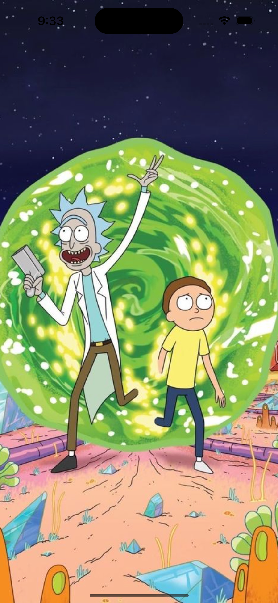
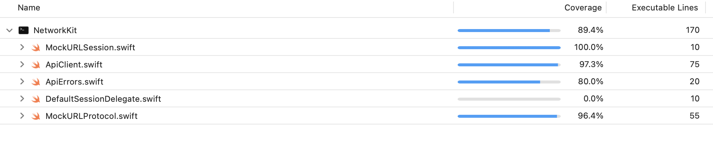

# Rick And Morty (Dummy App)

This app is a demonstration of SwiftUI + Combine, async/await for network calls, CLEAN + MVVM architecture, and Swift Package Manager for dependency management. The code is structured using a modular architecture where each Swift package represents a different module (e.g., characters, episodes, etc.), and all modules are integrated into the main app "Rick And Morty."

## Features

- **SwiftUI**: Utilizes SwiftUI for building user interfaces, enabling a declarative and reactive approach to UI development.
- **Combine**: Leverages Combine framework for handling asynchronous and event-driven programming, particularly for network calls and data binding.
- **Async/Await**: Employs async/await syntax for asynchronous operations, enhancing readability and simplifying code for network requests.
- **CLEAN + MVVM Architecture**: Adheres to CLEAN architecture principles with a focus on separation of concerns, testability, and maintainability. The MVVM (Model-View-ViewModel) design pattern is used for structuring UI-related logic.
- **Swift Package Manager**: Relies on Swift Package Manager for dependency resolution and package management, promoting modularity and reusability across the codebase.
- **Code Coverage**: Includes code coverage analysis to ensure comprehensive testing and quality assurance.

## Modules

- **Characters Module**: Handles functionality related to characters, including displaying character information, searching characters, and managing character details.
- **Episodes Module**: `To be developed later.`
- **Core Module**: Some of the functionalities like Dependency Injection, App Configuration, Remote ImageView, Utils etc which are to (or can) be used accross all modules.
- **Network Module**: Takes care of creating network request and executing them.

- **Main App**: Integrates all modules together to create the "Rick And Morty" app, offering a seamless user experience across characters, episodes, and locations.

## Installation

1. Clone the repository to your local machine.
2. Open the file `RickAndMorty.xcodeproj`.
3. Build and run the project on a simulator or device.

## (Public) API Credits
https://rickandmortyapi.com/documentation/

**List characters**: https://rickandmortyapi.com/api/character/?page=1

**Character details**: https://rickandmortyapi.com/api/character/1

## Snapshots and UITests

The `CharactersKit` module leverages snapshot testing to ensure the visual consistency of the user interface across different versions. Also, along with Unit Tests, UI tests are also written and can be executed altogether using one test plan.

### Snapshot Testing Configuration

- **Device used**: iPhone 15
- **Snapshots Directory**: The reference snapshots are stored within the repository under the `__Snapshots__` directory of each View Test's parent directory. The path is as follows:
 
    `Characters Module` > `Tests` > `CharacterKitTests` > `Presentation`

    - List > `__Snapshots__`
    - Details > `__Snapshots__`

### Exexuting Snapshot & UITests
To ensure the visual consistency and functional correctness of the app, follow these steps to execute snapshot and UI tests:

1. **Open the Project**:
    - Open `Characters.xcodeproj` in Xcode.

2. **Access the Test Navigator**:
    - Open the `Test Navigator` by hitting `Cmd + 6`.

3. **Run the Test Plan**:
    - Run the `CharactersTestPlan` from the Test Navigator.

4. **Test Targets Executed**:
    - **CharacterKitTests**: Along with other unit tests, the following snapshot tests for views are executed:
        - `CharacterListViewTests`
        - `CharacterDetailsViewTests`
    - **CharactersUITests**: UI tests for the character module are executed to ensure functional correctness.

5. **View Coverage**:
    - Coverage reports for both targets can be viewed under the `Reports Navigator` by hitting `Cmd + 9`.

## Screenshots

Glimpse of the app via screenshots:

### App Icon and Launch Screen

  
  

### Characters Listing and Details

  
  

## Code Coverage

Below is a screenshot of the latest code coverage summary:

### Characters Module

### Network Module

